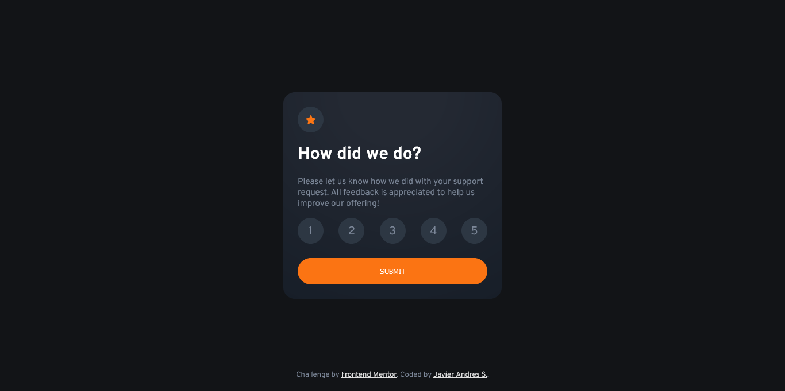
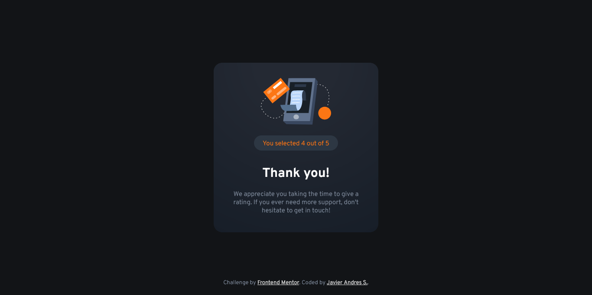
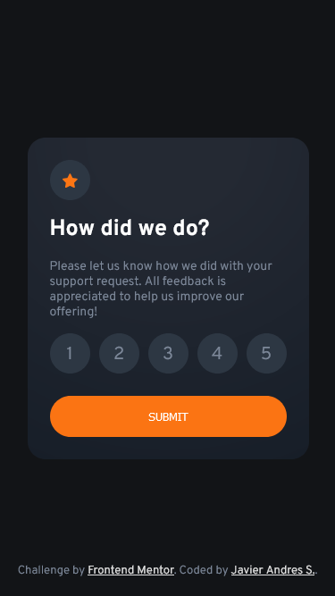
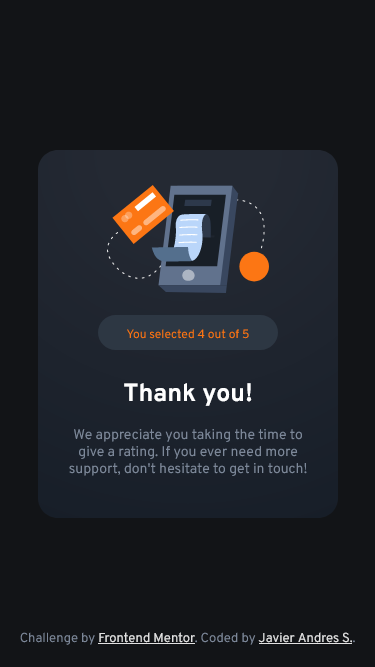

# Frontend Mentor - Interactive rating component solution

This is a solution to the [Interactive rating component challenge on Frontend Mentor](https://www.frontendmentor.io/challenges/interactive-rating-component-koxpeBUmI). Frontend Mentor challenges help you improve your coding skills by building realistic projects.

## Table of contents

- [Frontend Mentor - Interactive rating component solution](#frontend-mentor---interactive-rating-component-solution)
  - [Table of contents](#table-of-contents)
  - [Overview](#overview)
    - [The challenge](#the-challenge)
    - [Screenshot](#screenshot)
    - [Links](#links)
  - [My process](#my-process)
    - [Built with](#built-with)
    - [What I learned](#what-i-learned)
    - [Continued development](#continued-development)
    - [Useful resources](#useful-resources)
  - [Author](#author)

## Overview

### The challenge

Users should be able to:

- View the optimal layout for the app depending on their device's screen size
- See hover states for all interactive elements on the page
- Select and submit a number rating
- See the "Thank you" card state after submitting a rating

### Screenshot






### Links

- Solution URL: [https://github.com/javiandres016/frontend-mentor/tree/main/challenges/Interactive-rating-component](https://github.com/javiandres016/frontend-mentor/tree/main/challenges/Interactive-rating-component)
- Live Site URL: [https://javiandres016.github.io/frontend-mentor/challenges/Interactive-rating-component/](https://javiandres016.github.io/frontend-mentor/challenges/Interactive-rating-component/)

## My process

### Built with

- HTML5
- CSS
- Flexbox
- Javascript

### What I learned

These are the code snippets with methods and properties that I didn't know about.

```css
// hover
@media (hover: hover) {
  .opt-hover:hover {
    color: var(--white);
    background-color: var(--primary-color);
  }
  .btn-hover:hover {
    color: var(--primary-color);
    background-color: var(--white);
  }
}

// css variables
:root {
  --primary-color: hsl(25, 97%, 53%);
  --white: hsl(0, 0%, 100%);
  --light-grey: hsl(217, 12%, 63%);
  --medium-grey: hsl(216, 12%, 54%);
  --dark-blue: hsl(213, 19%, 18%);
  --very-dark-blue: hsl(216, 12%, 8%);
  --clr-blue: #2d3743;
  --font: 'Overpass', sans-serif;
}
```

### Continued development

my goal is to continue learning css, I realize that there is a lot that I don't know, properties, ways to write a more maintainable css and learn methodology

### Useful resources

- [darryncodes Solution](https://darryncodes.github.io/interactive-rating-component/) - this solution helped me as a guide to create my styles

## Author

- Github - [Javier Andres](https://github.com/javiandres016)
- Frontend Mentor - [@javiandres016](https://www.frontendmentor.io/profile/javiandres016)
