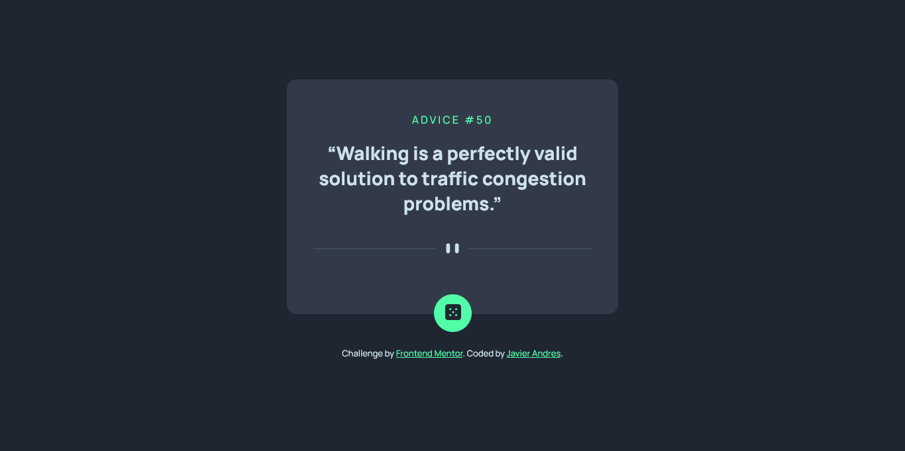
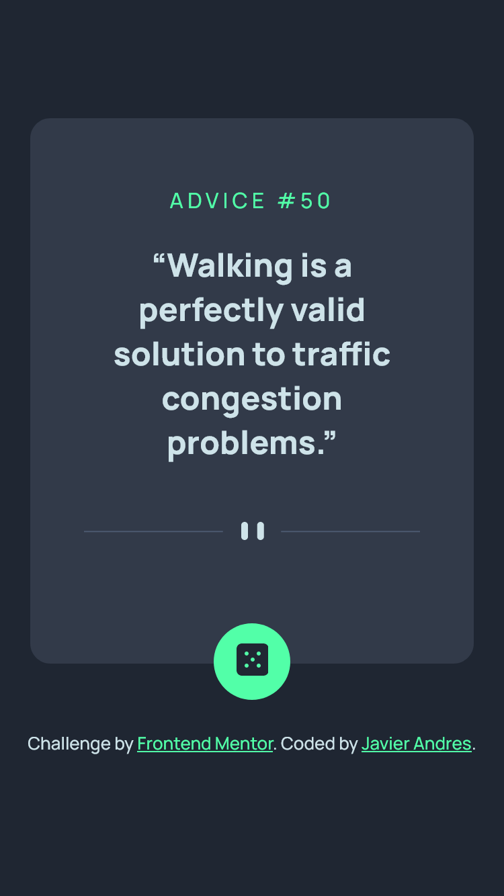

# Frontend Mentor - Advice generator app solution

This is a solution to the [Advice generator app challenge on Frontend Mentor](https://www.frontendmentor.io/challenges/advice-generator-app-QdUG-13db). Frontend Mentor challenges help you improve your coding skills by building realistic projects.

## Table of contents

- [Frontend Mentor - Advice generator app solution](#frontend-mentor---advice-generator-app-solution)
  - [Table of contents](#table-of-contents)
  - [Overview](#overview)
    - [The challenge](#the-challenge)
    - [Screenshot](#screenshot)
    - [Links](#links)
  - [My process](#my-process)
    - [Built with](#built-with)
  - [Author](#author)

**Note: Delete this note and update the table of contents based on what sections you keep.**

## Overview

### The challenge

Users should be able to:

- change advices by clicking on the button

### Screenshot

### Links

- Solution URL: 
- Live Site URL: 

## My process

### Built with

- HTML5
- javascript
- CSS
- Flexbox

## Author

- Github - [javiandres016](https://github.com/javiandres016)
- Frontend Mentor - [@javiandres016](https://www.frontendmentor.io/profile/javiandres016)
