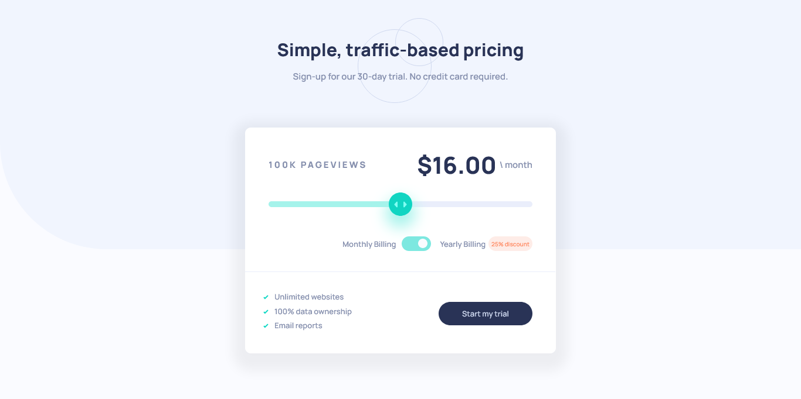

# Frontend Mentor - Interactive pricing component solution

This is a solution to the [Interactive pricing component challenge on Frontend Mentor](https://www.frontendmentor.io/challenges/interactive-pricing-component-t0m8PIyY8). Frontend Mentor challenges help you improve your coding skills by building realistic projects.

## Table of contents

- [Frontend Mentor - Interactive pricing component solution](#frontend-mentor---interactive-pricing-component-solution)
  - [Table of contents](#table-of-contents)
  - [Overview](#overview)
    - [The challenge](#the-challenge)
    - [Screenshot](#screenshot)
    - [Links](#links)
  - [My process](#my-process)
    - [Built with](#built-with)
  - [Author](#author)

## Overview

### The challenge

Users should be able to:

- View the optimal layout for the app depending on their device's screen size
- See hover states for all interactive elements on the page
- Use the slider and toggle to see prices for different page view numbers

### Screenshot

### Links

- Solution URL: [https://github.com/javiandres016/frontend-mentor/tree/main/challenges/interactive-pricing-component-main](https://github.com/javiandres016/frontend-mentor/tree/main/challenges/interactive-pricing-component-main)
- Live Site URL: [https://javiandres016.github.io/frontend-mentor/challenges/interactive-pricing-component-main/](https://javiandres016.github.io/frontend-mentor/challenges/interactive-pricing-component-main/)

## My process

### Built with

- Semantic HTML5 markup
- CSS
- Flexbox

## Author

- Github - [javiandres016](https://github.com/javiandres016)
- Frontend Mentor - [@javiandres016](https://www.frontendmentor.io/profile/javiandres016)
