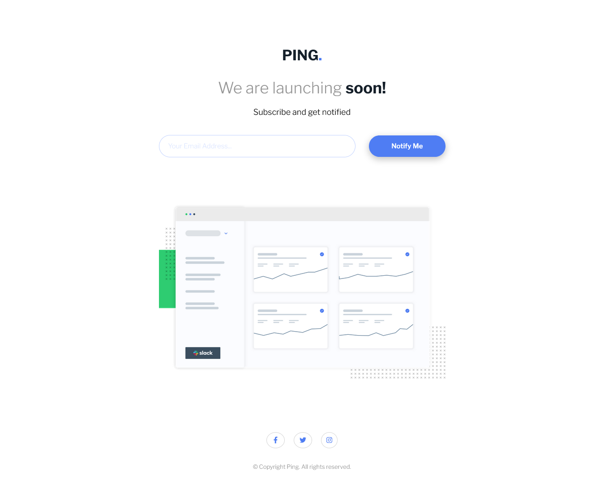

# Frontend Mentor - Ping coming soon page solution

This is a solution to the [Ping coming soon page challenge on Frontend Mentor](https://www.frontendmentor.io/challenges/ping-single-column-coming-soon-page-5cadd051fec04111f7b848da). Frontend Mentor challenges help you improve your coding skills by building realistic projects.

## Table of contents

- [Frontend Mentor - Ping coming soon page solution](#frontend-mentor---ping-coming-soon-page-solution)
  - [Table of contents](#table-of-contents)
  - [Overview](#overview)
    - [The challenge](#the-challenge)
    - [Screenshot](#screenshot)
    - [Links](#links)
  - [My process](#my-process)
    - [Built with](#built-with)
  - [Author](#author)

**Note: Delete this note and update the table of contents based on what sections you keep.**

## Overview

### The challenge

Users should be able to:

- View the optimal layout for the site depending on their device's screen size
- See hover states for all interactive elements on the page
- Submit their email address using an `input` field
- Receive an error message when the `form` is submitted if:
- The `input` field is empty. The message for this error should say *"Whoops! It looks like you forgot to add your email"*
- The email address is not formatted correctly (i.e. a correct email address should have this structure: `name@host.tld`). The message for this error should say *"Please provide a valid email address"*

### Screenshot

### Links

- Solution URL: [https://github.com/javiandres016/frontend-mentor/tree/main/challenges/ping-coming-soon-page-master](https://github.com/javiandres016/frontend-mentor/tree/main/challenges/ping-coming-soon-page-master)
- Live Site URL: [https://javiandres016.github.io/frontend-mentor/challenges/ping-coming-soon-page-master/](https://javiandres016.github.io/frontend-mentor/challenges/ping-coming-soon-page-master/)

## My process

### Built with

- HTML5
- SCSS
- Javascript
- Mobile-first workflow

## Author

- Github - [javiandres016](https://www.github.com/javiandres016)
- Frontend Mentor - [@javiandres016](https://www.frontendmentor.io/profile/javiandres016)
