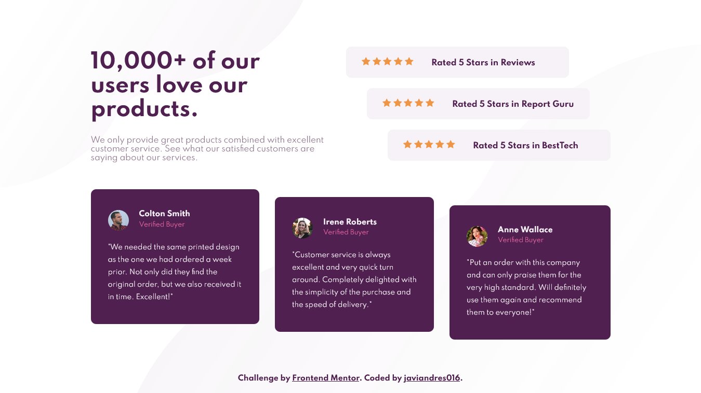
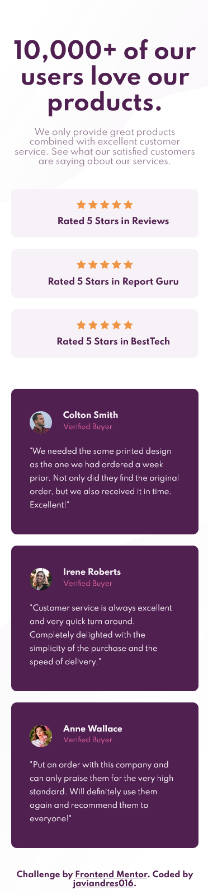

# Frontend Mentor - Social proof section solution

This is a solution to the [Social proof section challenge on Frontend Mentor](https://www.frontendmentor.io/challenges/social-proof-section-6e0qTv_bA). Frontend Mentor challenges help you improve your coding skills by building realistic projects.

## Table of contents

- [Frontend Mentor - Social proof section solution](#frontend-mentor---social-proof-section-solution)
  - [Table of contents](#table-of-contents)
  - [Overview](#overview)
    - [The challenge](#the-challenge)
    - [Screenshot](#screenshot)
    - [Links](#links)
  - [My process](#my-process)
    - [Built with](#built-with)
  - [Author](#author)

## Overview

### The challenge

Users should be able to:

- View the optimal layout for the section depending on their device's screen size

### Screenshot

### Links

- Solution URL: [https://github.com/javiandres016/frontend-mentor/tree/main/challenges/social-proof-section-master](https://github.com/javiandres016/frontend-mentor/tree/main/challenges/social-proof-section-master)
- Live Site URL: [https://javiandres016.github.io/frontend-mentor/challenges/social-proof-section-master/](https://javiandres016.github.io/frontend-mentor/challenges/social-proof-section-master/)

## My process

### Built with

- HTML5
- CSS
- Flexbox

## Author

- Website - [javiandres016](https://www.github.com/javiandres016)
- Frontend Mentor - [@javiandres016](https://www.frontendmentor.io/profile/javiandres016)
